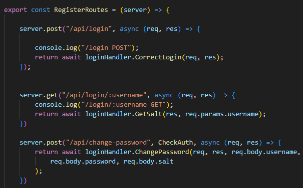
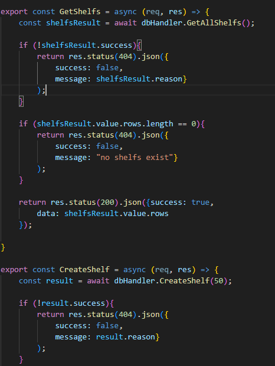
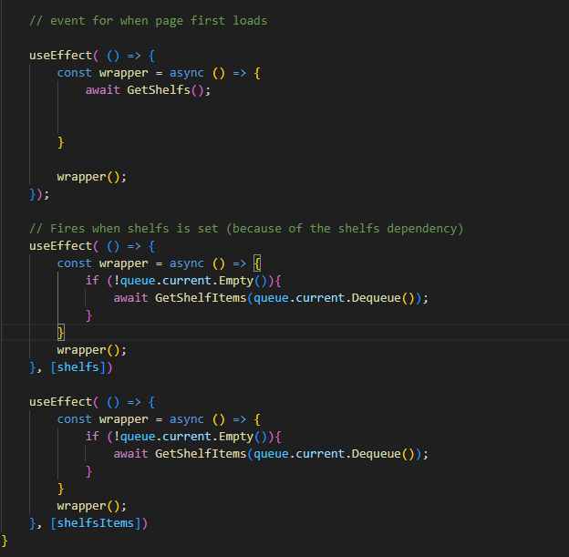
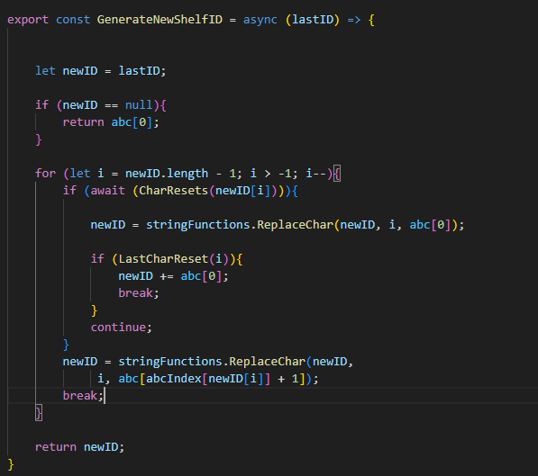

# Project phase 2
This Report outlines the created product's results and what changes might have been done differently from the initial project plan.

## 1. Environment

* Changes : 
    * For hosting the website, AWS was used as in the initial plan, but a **Github self hosted action runner** was implemented to automatically pull a commit from Github.
    * The free-tier VM was also little limiting on the frontend especially when installing with node package manager, the vm would often freeze when installing packages. 
    For this reason, the frontend package manager was changed to yarn that is little bit more lightweight.
    * The vm has scripts and services to automatically start the website on boot.

## 2. Backend

#### Backend has a pretty clear execution flow:
#### request -> Check client has required access
#### -> router forwards request to proper data handler
#### -> data handler calls functions from db handler 
#### -> db handler uses db connector to query db
### Flow back 
#### db query result -> returns to db handler
#### db handler  wraps result in a clean object
#### db handler returns result to data handler
#### data handler compiles data
#### -> data is returned back to client with status codes
* Changes:
    * Few additional packages were installed : cors for communication to backend and jsonwebtoken for token authentication.

* Data handlers all execute similar to each other:
     data handler calls dbhandler for data from database and does necessary checks for the result, before returning the data and possibly parsing if needed.

* Backend structure is the following:
    ## Router
    
    router.js contains all of the routes on the backend, and each route is forwarded to the appropriate data handler (loginHandler, mainHandler, itemHandler).

        * The router also has a middleware used to authenticate request origin for tokens:
        

    ## data handlers

    
   
    mainHandler handles data that has to do with shelfs or shelf items (**main** coming from main page).

    
    loginHandler has functions related to login and users.

    
    itemHandler has functions related to items.

    ## db handler

    
    dbHandler contains all functions needed in the app to query database.
    The file declares all possible queries at the top of the file:
    
    And these are executed on the database with parametrized queries where possible.
    dbHandler sometimes also chains it's functions to get to a result (
        create shelf -> generate new shelf name -> execute query to create shelf table with generated name
    )

    dbHandler must be initialized before it can be used. For this it uses two
    different database connectors depending on are you running tests or production.
      
    This enables dbHandler to work with different databases without creating duplicate code.

    ## db connector

    
      This is the production connector, both connectors are almost identical but they use different object from the credentials file:
    

## 3. Frontend

* Changes:
    * Initial plan had some dialog-style popups for editing information on the website, but these were changed to unique sites for the time it would take to learn these style of elements would have taken too much, as there is no previous experience with react.
    * Some packages were installed that are not in the initial plan: crypto-js for hashing user password before further processing it over http and react-router for easier routing of frontend pages.
    * The node package manager had to be changed to yarn, as the npm would often hang due to small RAM size(1GB).

### The frontend routing
Routing would start from login page, where user would always be redirected if accessing a page without active token.   

Each page has been seperated into it's own components, which are then rendered based on route.

Each page has access to context data, that is initialised and changed in the main file with all the routes, such as user role, username, functions for when authentication is needed (redirect to login page).

### The general execution flow of page:
#### -> client accesses page
#### -> if page has data that needs to be displayed, fetch them from backend
#### -> display data 
#### -> User input received -> site stores updated value states
#### -> A "confirm" action has been executed by user eg. Create item
#### -> make a request to backend with saved state values
#### -> "reset" page by fetching displayed data again

### Example Shelfs page:

function for fetching shelfs from database

function for fetching items stored in a specific shelf

Now this is where it gets a little complicated:

* Some groundwork  
useEffect fires everytime the given dependency is changed (dependency is one that uses **useState()** to keep it's value between renders and what's change causes re-render)
if the useEffect is not given a dependency array, it fires when the page is mounted ( or loaded).  

So what happens if you use the page load useEffect (without dependencies) to:  
getShelfs -> loop through each shelf to get each shelf's items?
  
First the needed functions:   
getShelfs -> this sets a state variable "shelfs" with all of the shelfs in an array 
 
-> getShelfs() -> shelfs = ["shelf1", "shelf2" ...]

  
function to get a shelf's items and set state variable shelfsItems:  

-> Get all shelfs -> loop through each shelf in shelfs **in a single useEffect call**

result = loop executes zero times in useEffect()?!?!

This displays that the useState() setting of a variable is not indeed instant...

Fix:
Use TWO useEffect() calls:

Now the second useEffect executes when the **shelfs** state variable has been updated.   

But still no luck. One or two shelf's items might flash on the screen momentarily and then disappear.

We still have the same problem with state update not being instant here:

When we are copying the item's from the existing object, the state might not always have updated from our previous loop, which means we are not actually copying anything.  

And then we set the object again, with none of the already added items...
 
Fix:   
Use THREE useEffect() calls, useRef and a queue:  

  
Queue implementation
  

useRef stores the object in a state that is not wiped clean on re-render as with normal variables. You can access the item via the **current** attribute: 

  Add each shelf to the queue.  

And then the useEffect calls:

Now, The first useEffect when the page is mounted, fetches the shelfs.
  -> shelfs useEffect() fires because shelfs is set in the first useEffect 
-> The second useEffect get's the first shelf's items and updates the **shelfsItems** state variable  
-> the shelfsItems useEffect() fires because we just updated the **shelfsItems** state variable. 
the **shelfsItems** useEffect() loops until the queue is empty.  

Now the **shelfsItems** should be updated only once the previous state has been set right?!!?

  

# NO

 

 

 

 

 

 

 

 

 

 

 

 

 

 

 

 

 

 

 

 

 

 

 

 

 
Seems the useEffect might fire little bit before the state has actually updated in the state variable. 

Well... What now?  

Luckily, there is a way to get the latest state from the state variable :  

This passes a callback function into the state variable's set function.   
Which means, even though the value of the state variable has not updated yet to the getter, you get the latest value (set last GetShelfItems() call).  

#### So long story short
This is why shelfs contains a queue logic, even though it doesn't need one, there 
has been no energy to crunch refactoring shelfs page to this version.

    

## 4. Database

* Changes:
    Database schema has not really changed, the dbHandler does initiate the database on each boot with this sql file:
    

    The dbHandler file contains a function that parses the file to seperate commands and executes it on the database.
    Additionally to this schema, there is the shelf table schema that is created dynamically: 
    

    inserting the table name returned from the frontend seems scary, but luckily the table creation algorithm only creates tables with chars between a-z.  
    So the tablename can be checked for all other special characters or spaces to prevent sql injection:
    

    The generation algorithm for new shelfname looks like this:
    
    The algorithm takes in the last created shelf (largest id in shelfs table) and then generates a new id.   z becomes aa and az becomes ba and so on...

## 6. Functionalities

One function was forgotten to implement (prompt user to move to existing item page to change balance on item creation) with small differences marked with *:

## Creating storage space
* User wants to create shelfs and shelf locations for each shelf
* User selects shelf count and amount of shelf space in each shelf
* Each shelf is displayed seperately with shelf space set to the general user set amount and the shelf space can additionally be modified for each shelf  
***User needs to create each shelf seperately and then move into the shelf's page to change the shelf size**

## Adding a new item to an empty shelf space
* User wants to add a new item to an empty shelf space
* User fills out item info and selects shelf and shelf space that the item will be stored in
* If item already exists, prompt a question to change existing item balance  
***There is no prompt to move to existing item page**

## Transferring item from shelf space to another
* User first selects the item to be transferred
* User selects new shelf and shelf space for the item
* Clarified workflow : item page -> transfer item -> transfer to new empty location  
***No popup dialog, shelf and location is selected from dropdown list.**

## Adding balance to shelf space
* User searches for the shelf space or for the item
* User adds new balance to the shelf space  
***User cannot search for a shelf space, but user can search for an item and this will return all shelfs with the item in it's shelf**

## Searching for items
* User wants to search if required item is available in the warehouse
* User searches the item by model from the system
* Item page displays the balance of the item  
***User can search the item by manufacturer, model or serial**

## Additional things from original plan
* The original plan specifies that you can search an item based on item attributes or item shelf location.
item shelf location search has not been implemented, for if user wants to see what item is in a shelf location, they can just navigate to the shelf to see all shelf locations.

## 7. Code quality and documentation

Code itself has not been documented in any way, besides this report and initial design file. The code has been created with a principal of :
function does only one function, and these functions are used in a "driver" function that is exposed.  
This enables function names to be descriptive for what they do.

## 8. Testing and error handling

### Backend
Backend has unit tests made for most of the database functionalities, declared in backend/src/unitTests/DATABASE_tests.test.js  
This has enabled the development of backend seperately from frontend and to confirm correct functionality of backend.

### Frontend
Frontend has been tested via action flows described in the initial project plan, and also by mixing each page's input order (in which order values are changed).
The website has had few outside users also to give their opinion and for the developer to monitor how easily new user's can grasp how the application works.

## 9. User interface and interaction

The UI and UX experience has been developed with a principle of ("If you shouldn't be able to do it, you can't do it").
 
Example would be going into a shelf's item page where you have the ability to change item's location, balance and shelf.
 
If you haven't changed any of the values, you also shouldn't be able to save the item changes, so the save button is disabled.

For the UI, all of the pages have been made to try to keep them simple and informative what each element does/mean.