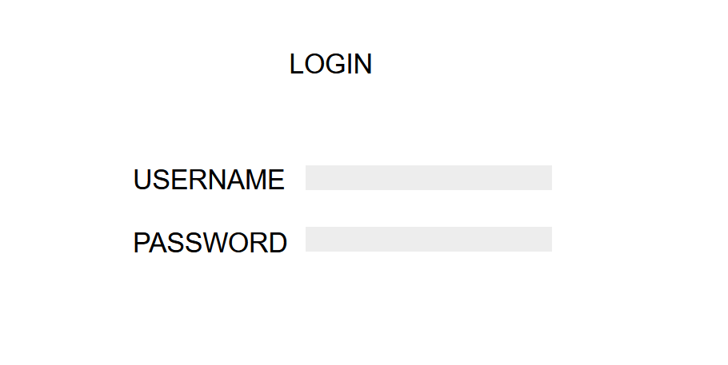
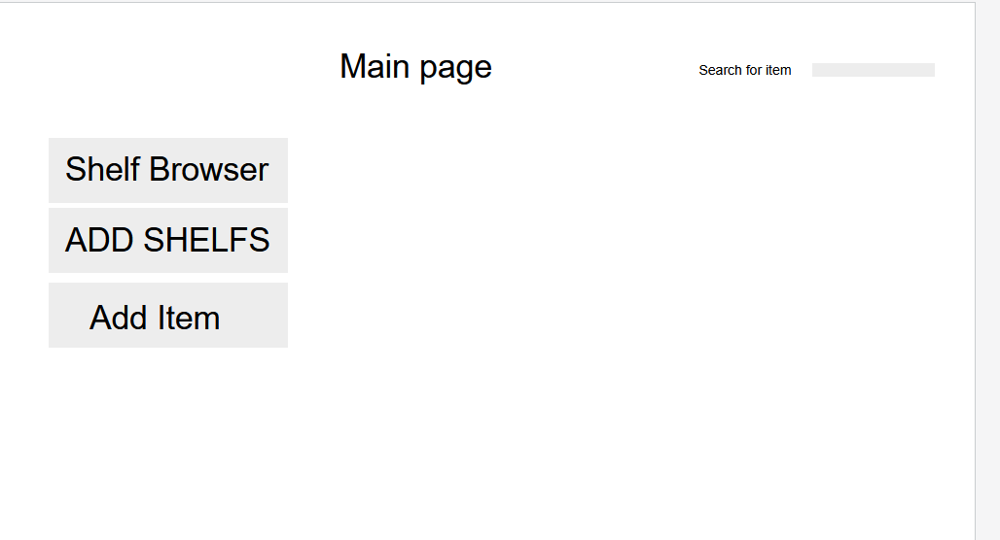
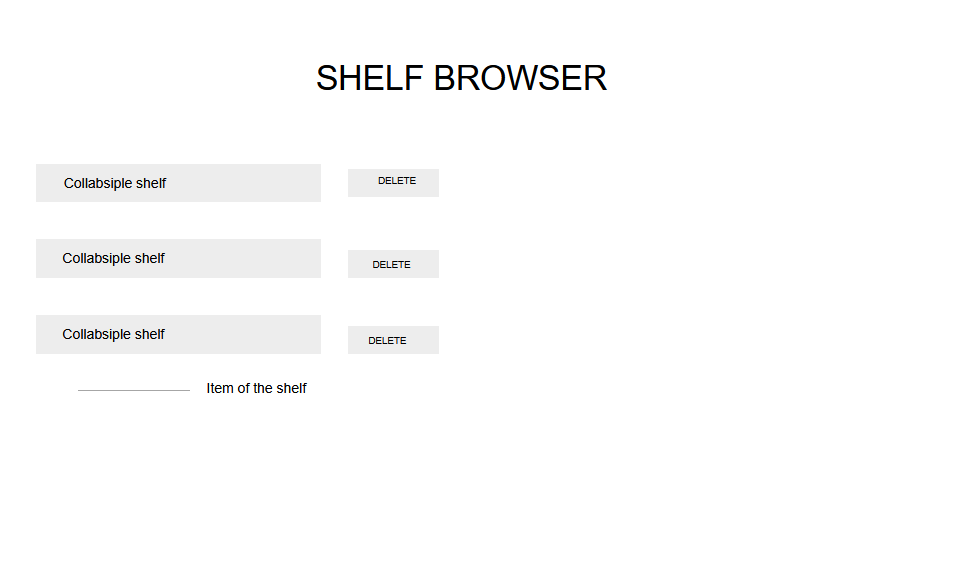
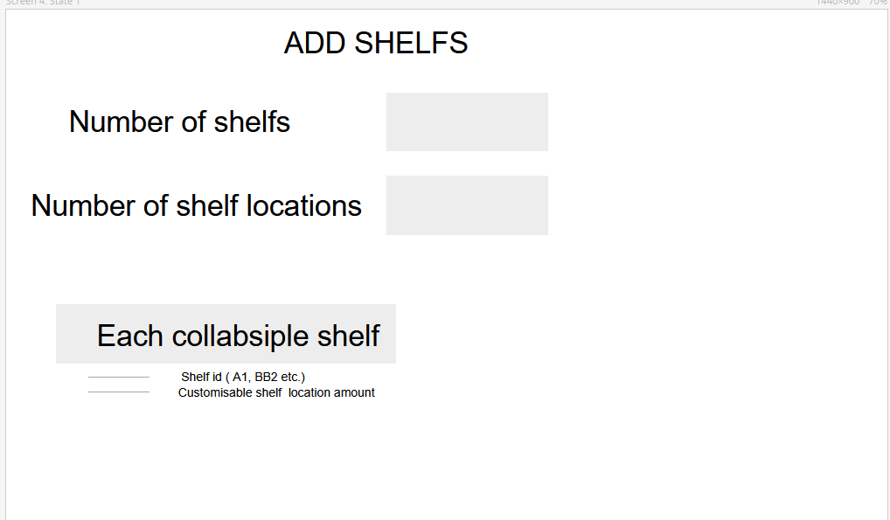
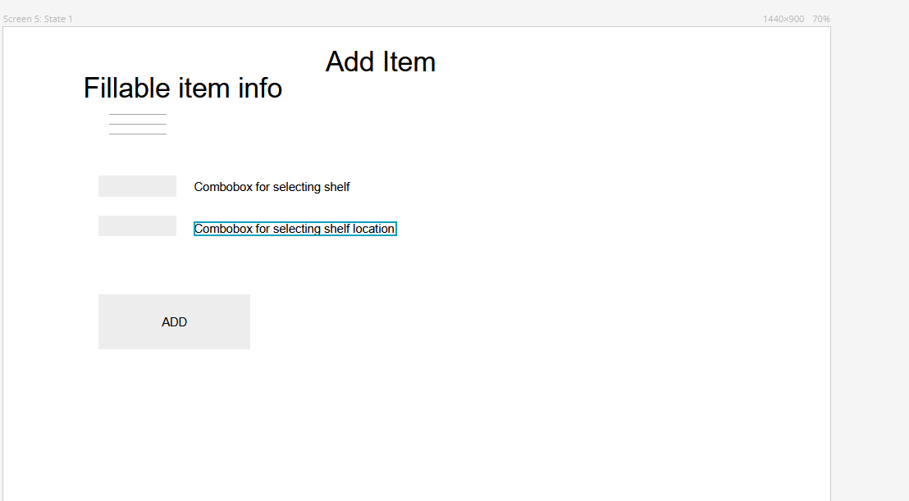
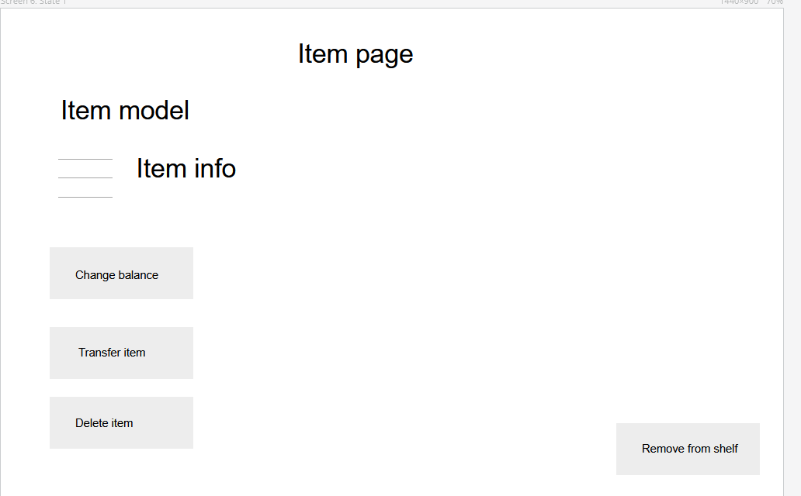
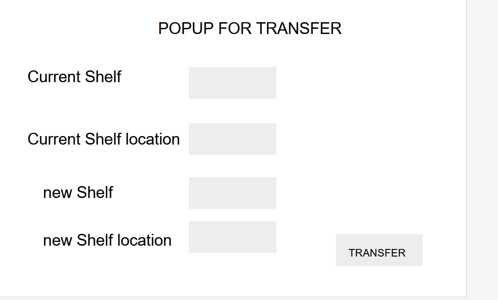
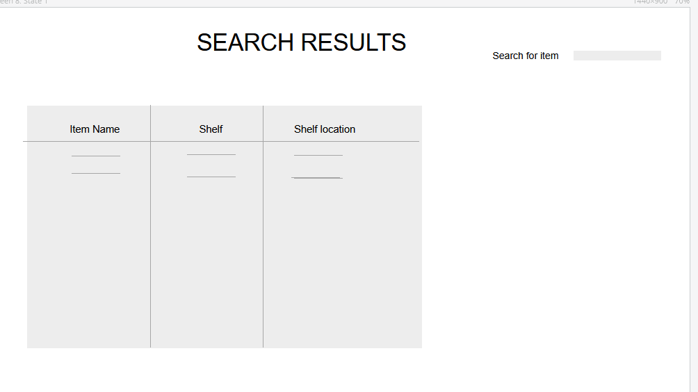

# 1. User Profiles

 User           | Defined Access            | Available Functionality                                  
----------------|-------------------------- |---------------------------------------------------------
 Observer       | Read only                 | Lookup warehouse item balance and specific item info    
 Warehouse User | Read, Write               | Warehouse intended functionalities, see Warehouse management of functionality section               
 Admin / Dev    | Read, Write, Create Users | All available functions of the system                  

# 2. Functionality 
## Warehouse management

### Requires account level minimum of warehouse user level account

* Take item in to warehouse (Add item balance / Add new item)
    * Add item specific information
    * Item location in warehouse (Add new item)
    * Or add item balance if location already exists (Add balance)

* Remove balance for an item (Take out of warehouse)

* Transfer existing item to new empty location
    * Transfer moves whole balance to new shelf location
    * Target location must be empty, and old location is deemed empty on transfer, where a new item can be transferred to.

* Create item storage location
    * Create amount of shelfs (A, B , C and so on)
    * Create amount of shelf locations on shelfs (1- 10 000)
    * Each shelf's location amount can be changed after shelf has been created (one has 50 shelf space, one has 100 shelf space and so on)
    * Shelf id is generated via starting alphabet over once run through with the second letter incrementing (AA, AB, AC). This has no upper limit

* Increase shelf's space
    * Single shelf's space can be increased

* Delete item from a shelf space
    * Select item
    * Remove from shelf button

* Delete shelf
    

### Requires minimum account level

* Check item balance

## Account management

* Only Admin / dev account level can authorize new accounts
    * New accounts password must be changed by user after logging in for the first time with admin created credentials

* System cannot be accessed without credentials
* User's authorization cookie's will expire after 8 hours

## Searching in the system

* Item can be searched by one of these item attributes:
    * manufacturer
    * model 
    * S/N
    * Shelf and shelf location
    
* Each shelf's items can be browsed through via a interface that lists all the available shelfs. 

# 3. What is an item

## Item needs to have these attributes

* Manufacturer
* Model
* S/N
* balance

In this system, the same item can be in multiple different shelfs and shelf locations, but this isn't likely to happen, but it is taken into consideration when designing the system.

# 4. User actions

## Creating storage space
* User wants to create shelfs and shelf locations for each shelf
* User selects shelf count and amount of shelf space in each shelf
* Each shelf is displayed seperately with shelf space set to the general user set amount and the shelf space can additionally be modified for each shelf

## Adding a new item to an empty shelf space
* User wants to add a new item to an empty shelf space
* User fills out item info and selects shelf and shelf space that the item will be stored in

## Transferring item from shelf space to another
* User first selects the item to be transferred
* User selects new shelf and shelf space for the item
* Clarified workflow : item page -> transfer item -> transfer to new empty location

## Adding balance to shelf space
* User searches for the shelf space or for the item
* User adds new balance to the shelf space

## Searching for items
* User wants to search if required item is available in the warehouse
* User searches the item by model from the system
* Item page displays the balance of the item

# 5. UI Prototypes

# 6. Technologies

## Hosting
### Hosting is done with AWS
* Web hosted VM is requirement for the course
* AWS VM is familiar for the team

## Frontend
### Frontend is done via React
* React is a graded requirement of the course
* React enables ability to make clean and responsive UI.

## Backend
### Backend is done with Node
* Node is one of the graded requirements for the course
* Node is used as a API for interacting with the DB

## Database
### Database is done with PostgreSQL
* PostgreSQL is a requirement for the course
* Relational database works well with the system design

## General system notes
System uses http, https would be better but won't be used for this project.

Unit tests are made for database queries.

Backend must return appropriate result codes.

UI functionality will be tested manually.

# 7. Database structure

### Shelfs table

* ID
* Shelf id (A1, A2 etc.)
* Shelf table id -> references a shelf table

### Shelf table (Dynamically created, represents each shelf, named shelf_XX (shelf_A1 etc.))

* ID
* Item id -> references items table item id
* Balance
ON DELETE SET NULL; (When an item is deleted from items table, this will become null)

### Items table

* ID 
* Manufacturer
* Model
* S/N

### Users table
* ID 
* username

### Passords table

* Username -> references users table ID
* value (hashed password)
* salt

## Logic for querying data
* Get specific shelfs items
    * Query all from shelf table linked with shelfs table's shelf id (shelf id is specific shelf's id)
    * Query each item's info from items table with item id from shelf table

* Search function with user input
    * Query id from all matching item names from items table
    * Query each shelf table found in shelfs table with the found matching item id's

## Database sanitation
When querying database, all user input will be used in parameterized queries to avoid sql injection.
Passwords will be hashed, so no plain passwords will be stored.
Passwords will be salted with 10 random chars.

Hashing and salting will use already existing libraries that are proved to be safe.

# 8. Scheduling

* Project will be developed according to the teams available time that is about 20 hours per week.
* Project will also be follow course deadlines for the project (Design, implementation, presentation).

# 9. User testing

* User testing will be reviewed based on the needed functionality. 
* When all of the functionality that is defined in the Functionality section, system will be done.
## Below are some guidelines for the workflows of the functionality actions
### Adding item:
* Add Item -> item adding page
    * Input item data
    * Shelf and shelf location
    * If item exists, ask if user wants to just add balance. If yes, -> go to existing item page to add balance

### Transferring item
* Search item -> item page
* transfer item -> new available shelf and shelf location that is empty
* transfer

### Create shelf and shelf locations
* Create shelf space -> add amount of shelfs and shelf space (Only new shelf id's are displayed, that are continued from latest shelf id) 
* If needed, from the new displayed shelf list, customize each shelf's space.

### Increase existing shelf size
* Shelfs -> single shelf (eg. A shelf)
* Increase size from for example 10 to 20

### Delete item
* Search for an item
* Item page is displayed
* Delete item
* All balance of the item will be deleted and the shelf space will be empty (itemless)

### Delete shelf
* Go to shelf browser
* Delete shelf

